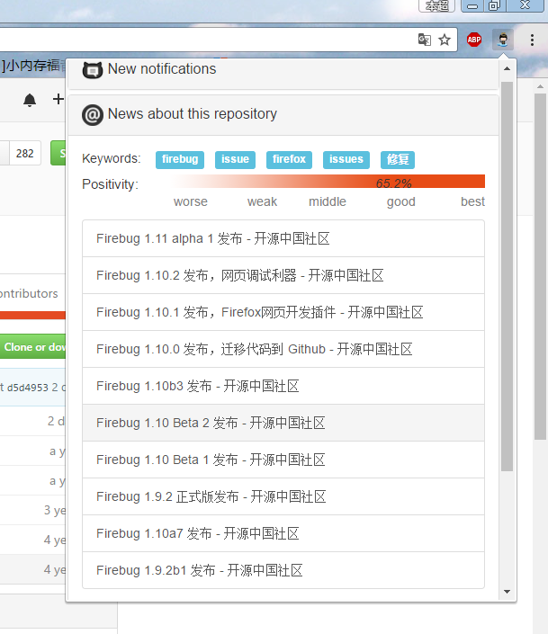
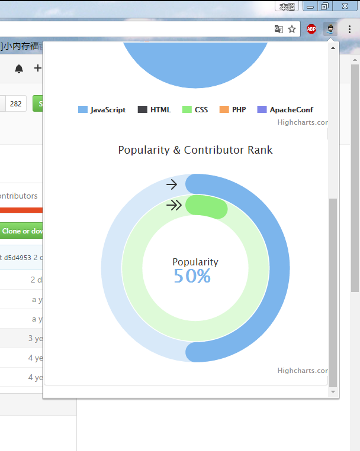

#Gitmining: find something interesting in Github
===

##软件简介
Gitming项目期望分析Github网站数据，从中获取有用的统计信息以便找到适合的开源项目。 
项目共分为四次迭代：
 * 迭代一：使用Java Swing展示数据，熟悉Github API
 * 迭代二：使用JavaFX进行数据可视化
 * 迭代三：基于Hibernate+Spring+SpringMVC的web应用，展示数据分析结果（echarts）
 * 迭代四：chrome插件开发，展示项目的评论情感指数、项目相关的新闻、项目在Github中的整体水平。
 

##软件截图
###客户端封面：

###迭代三网页：

###chrome插件：
####同类仓库比较：

####订阅消息推送:

####新闻和评论：

####统计信息：

